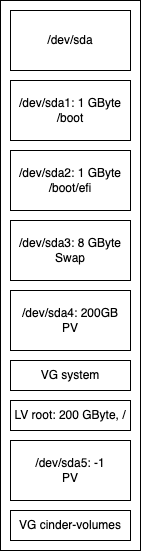

# Node-Images

| :zap: When booting from one of these images, all data on the hard disks will be destroyed without confirmation. :zap: |
|-----------------------------------------------------------------------------------------------------------------------|

## Usage of the node images

* Copy image to USB stick or place the image on your network provisioning environment (Redfish, BMC mount, ....)
* Mount the image in the BMC in another way
* Boot from the device
* Installation is performed, system shuts down afterward
* Unmount the device or remove it and start system
* After the first boot the system shuts down again
* System is ready for use, by default DHCP is tried on all available  interfaces
* Perform a SSH-login
  * user: ``osism``
  * password: ``password``

## Available images

### Generic Node Images

#### Variant 1

[Standard Image](https://swift.services.a.regiocloud.tech/swift/v1/AUTH_b182637428444b9aa302bb8d5a5a418c/osism-node-image/ubuntu-autoinstall-1.iso) - 
  [[SHA256]](https://swift.services.a.regiocloud.tech/swift/v1/AUTH_b182637428444b9aa302bb8d5a5a418c/osism-node-image/ubuntu-autoinstall-1.iso.CHECKSUM)


#### Variant 2

* [Standard Image](https://swift.services.a.regiocloud.tech/swift/v1/AUTH_b182637428444b9aa302bb8d5a5a418c/osism-node-image/ubuntu-autoinstall-2.iso) - 
  [[SHA256]](https://swift.services.a.regiocloud.tech/swift/v1/AUTH_b182637428444b9aa302bb8d5a5a418c/osism-node-image/ubuntu-autoinstall-2.iso.CHECKSUM)
* Regio Cloud Images<BR>
  used for the REGIO.cloud environment, variants of the used devices.
  * [OSISM 1](https://swift.services.a.regiocloud.tech/swift/v1/AUTH_b182637428444b9aa302bb8d5a5a418c/osism-node-image/ubuntu-autoinstall-osism-1.iso) -
    [[SHA256]](https://swift.services.a.regiocloud.tech/swift/v1/AUTH_b182637428444b9aa302bb8d5a5a418c/osism-node-image/ubuntu-autoinstall-osism-1.iso.CHECKSUM)<BR>
    Like `Variant 2`, with `/dev/nvme3n1` and `/dev/nvme4n1`<BR>
  * [OSISM 2](https://swift.services.a.regiocloud.tech/swift/v1/AUTH_b182637428444b9aa302bb8d5a5a418c/osism-node-image/ubuntu-autoinstall-osism-2.iso) - 
    [[SHA256]](https://swift.services.a.regiocloud.tech/swift/v1/AUTH_b182637428444b9aa302bb8d5a5a418c/osism-node-image/ubuntu-autoinstall-osism-2.iso.CHECKSUM)<BR>
    Like `Variant 2`, with `/dev/nvme4n1` and `/dev/nvme5n1`<BR>
  * [OSISM 3](https://swift.services.a.regiocloud.tech/swift/v1/AUTH_b182637428444b9aa302bb8d5a5a418c/osism-node-image/ubuntu-autoinstall-osism-3.iso) - 
    [[SHA256]](https://swift.services.a.regiocloud.tech/swift/v1/AUTH_b182637428444b9aa302bb8d5a5a418c/osism-node-image/ubuntu-autoinstall-osism-3.iso.CHECKSUM)<BR>
    Like `Variant 2`, with `/dev/nvme2n1` and `/dev/nvme3n1`<BR>
  * [OSISM 4](https://swift.services.a.regiocloud.tech/swift/v1/AUTH_b182637428444b9aa302bb8d5a5a418c/osism-node-image/ubuntu-autoinstall-osism-4.iso) - 
    [[SHA256]](https://swift.services.a.regiocloud.tech/swift/v1/AUTH_b182637428444b9aa302bb8d5a5a418c/osism-node-image/ubuntu-autoinstall-osism-4.iso.CHECKSUM)<BR>
    Like `Variant 2`, with `/dev/nvme0n1` and `/dev/nvme1n1`<BR>


#### Variant 3

[Standard Image](https://swift.services.a.regiocloud.tech/swift/v1/AUTH_b182637428444b9aa302bb8d5a5a418c/osism-node-image/ubuntu-autoinstall-3.iso) - 
  [[SHA256]](https://swift.services.a.regiocloud.tech/swift/v1/AUTH_b182637428444b9aa302bb8d5a5a418c/osism-node-image/ubuntu-autoinstall-3.iso.CHECKSUM)


#### Variant 4

[Standard Images](https://swift.services.a.regiocloud.tech/swift/v1/AUTH_b182637428444b9aa302bb8d5a5a418c/osism-node-image/ubuntu-autoinstall-4.iso) - 
  [[SHA256]](https://swift.services.a.regiocloud.tech/swift/v1/AUTH_b182637428444b9aa302bb8d5a5a418c/osism-node-image/ubuntu-autoinstall-4.iso.CHECKSUM)


## Cloud-in-a-box images

The [cloud in a box](https://osism.tech/docs/guides/other-guides/cloud-in-a-box) documentation provides more details about this.

### Variant 1 -  SCSI images

[Sandbox Image](https://swift.services.a.regiocloud.tech/swift/v1/AUTH_b182637428444b9aa302bb8d5a5a418c/osism-node-image/ubuntu-autoinstall-cloud-in-a-box-1.iso) - 
    [[SHA256]](https://swift.services.a.regiocloud.tech/swift/v1/AUTH_b182637428444b9aa302bb8d5a5a418c/osism-node-image/ubuntu-autoinstall-cloud-in-a-box-1.iso.CHECKSUM)



### Variant 2 - NVMe images

 * [Sandbox Image](https://swift.services.a.regiocloud.tech/swift/v1/AUTH_b182637428444b9aa302bb8d5a5a418c/osism-node-image/ubuntu-autoinstall-cloud-in-a-box-2.iso) - 
   [[SHA256]](https://swift.services.a.regiocloud.tech/swift/v1/AUTH_b182637428444b9aa302bb8d5a5a418c/osism-node-image/ubuntu-autoinstall-cloud-in-a-box-2.iso.CHECKSUM)
 * [Edge Image](https://swift.services.a.regiocloud.tech/swift/v1/AUTH_b182637428444b9aa302bb8d5a5a418c/osism-node-image/ubuntu-autoinstall-cloud-in-a-box-edge-2.iso) - 
   [[SHA256]](https://swift.services.a.regiocloud.tech/swift/v1/AUTH_b182637428444b9aa302bb8d5a5a418c/osism-node-image/ubuntu-autoinstall-cloud-in-a-box-edge-2.iso.CHECKSUM)<BR>
   Like Sandbox `Variant 2`, with `CLOUD_IN_A_BOX_TYPE=edge` boot parameter.


## Frequently asked Questions / Known Issues

### Download and verify images

```bash
osism_image(){
  local url="${1?image url}"
  wget -c "${url}" && \
  wget -c "${url}.CHECKSUM" && \
  sha256sum -c "$(basename ${url})" < "${url}"
}

osism_image <image url>
```

### Disk initialization fails

Disk initialization may fail if the devices have been in use before.
In particular having a MSDOS-type partition table will cause the
installation to break. In this case boot some Ubuntu live image and
erase all data from your disks.

In that case it is a good idea to erase the disk:
```bash
dd if=/dev/zero of=/dev/<device> bs=1M count=1024
```
(you can use that from the shell prompt available from the installation image or with a live systems)

## References

* https://curtin.readthedocs.io/en/latest/topics/storage.html
* https://github.com/cloudymax/pxeless
* https://jimangel.io/posts/automate-ubuntu-22-04-lts-bare-metal/
* https://ubuntu.com/server/docs/install/autoinstall-reference
