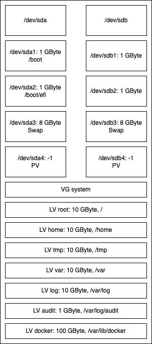
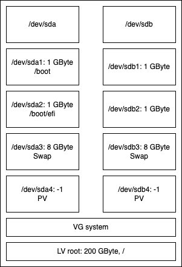
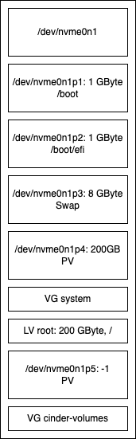

# Node Images

The image is in maintenance mode. We are currently no longer using it ourselves
as we have switched to a new approach for providing the nodes for ourselves and
our customers: the Metalbox. We are not yet archiving the repository. If anyone
is currently using it and needs changes, please open issues.

| :zap: When booting from one of these images, all data on the disks will be destroyed without confirmation. :zap: |
|------------------------------------------------------------------------------------------------------------------|

## Usage of the node images

## Requirements

The disks used must be at least 480 GByte in size.

### Installing generic images

1. Connect one ore more ethernet ports and provide DHCP with gateway- and DNS access
2. Add the installation media to your system
   * Copy image to USB stick
   * Place the image on your network provisioning environment
    (Redfish-BMC Mount)
3. Boot from the device
4. Mount the image in the BMC in another way
5. Installation is performed, system shuts down afterwards
6. Unmount the device or remove it and start system again
7. After the first boot the system shuts down once more
8. Start the system, system is ready for use, by default DHCP is tried on all available interfaces
9. Perform a SSH-login
   * user: `osism` (alternatively use `dragon` after the 2nd deployment run)
   * password: `password`

### Installing images with "Routing on the Host"

Normally, for reasons of efficiency, you would like to use the default images provided by OSISM for the installation.
However, if you want to install systems that use Routing on the Host you have to integrate a number of parameters
into the image for the installation.

These parameters are listed in the file `parameters-routing-on-the-host.yml.sample` as example.

The installation is then carried out as follows:

1. Configure the BMC of the server hardware and configure the following properties
   * The hostname of the system
   * The BMC IP address
     (the last number of the IPv4 adress is used for building the node ASN, the node IPs, ..)
   * Configure the involved switches to have a BGP peering with the host
2. Build a node image specific for your environment
   (see [parameters-routing-on-the-host.yml.sample](./parameters-routing-on-the-host.yml.sample)
3. Add the installation media to your system
   * Copy image to USB stick
   * Place the image on your network provisioning environment
    (Redfish-BMC Mount)
4. Boot from the device
   Installation is performed, system shuts down afterwards
5. Unmount the device or remove it and start system again
6. After the first boot the system shuts down once more
7. Start the system, system is ready for use
   (System starts with a ready to use network setup: dummy interface, frr-config, ...)
8. Perform a SSH-login
   * user: `osism` (alternatively use `dragon` after the 2nd deployment run)
   * password: `password`

## Creation of specific images

If the node images created in the release process are not sufficient or variants are required
that need specific parameters (e.g. for the setup of layer 3 underlay nodes), variants of the images can be created.

### The build process

[Jinja2](https://jinja.palletsprojects.com) is used here as a templating mechanism. By adding new templates or
specific logic, operators of osism cloud environments can use their own flavor of node images.

Node images are created using the [`create-image.sh`](./create-image.sh) tool, which uses
templates from the [`templates`](./templates)` folder.

Values used in the templates are obtained from the following sources and in the following hierarchy:

1. from the `vars` section of the respective node image in `.zuul.yaml`.
2. from parameters that are passed via the `--parameters <key>=<value>` parameter.
3. via a YAML file that is passed with `--config <filename>`.

Last values are effective / winning.

```bash
usage: create-image.sh [-h] (--show | --build BUILD [BUILD ...] | --env | --clean) [--parameters KEY=VALUE [KEY=VALUE ...]]
                       [--config CONFIG] [--template-only] [--layer3_underlay]


options:
  -h, --help            Show this help message and exit
  --show, -s            Show possible images
  --build BUILD [BUILD ...], -b BUILD [BUILD ...]
                        Build images
  --env, -e             Create build environment
  --clean, -r           Drop cached build data
  --parameters KEY=VALUE [KEY=VALUE ...], -p KEY=VALUE [KEY=VALUE ...]
                        Extra values, see template
  --config CONFIG, -c CONFIG
                        A config as yaml file
  --build-directory BUILD_DIRECTORY
                        Overwrite the default build directory
  --template-only, -t   Do only templating
```

### Build an image with adapted/new values

In order to just test the templating and show the effective values
(templated files are created in the [`./build`](./build) folder):

```bash
$ ./create-image.sh --build node-image-build-osism-1 --parameters layer3_underlay=true --template
Created context (yaml):
---
asn_node_base: '42100210'
asn_part_digits: '0'
description: Two mirrored NVME disks with a enhanced set of predefined logical volumes
  (/dev/nvme3n1 and /dev/nvme4n1)
interface1_asn: '65405'
interface1_name: enp2s0f0np0
interface2_asn: '65404'
interface2_name: enp2s0f1np1
ipv4_base: 10.10.21.
ipv6_base: 'fd0c:cc24:75a0:1:10:10:21:'
ipv6_hex: 'false'
layer3_underlay: 'true'
variant: osism-1
password_hash: $5$H2wkOHUVMIm2Yl2n$2AR/A2ILtgZcWx5UXL6N56Ha/wkdGvs0w5sFUMQ3iaB
ssh_public_key_user_osism: '# no key specified'
....
```

Build the image:
````bash
$ ./create-image.sh \
    --build node-image-build-osism-1 \
    --config Supermicro_A2SDV-8C-LN8F.yml \
    --parameters "ipv6_base=fd0c:cc24:75a0:1:10:10:21:" "layer3_underlay=true"
````

### Charateristics of layer3_underlay deployments

The parameter `layer3_underlay: 'true'` enables the support for layer3 underlays for the image.

The logic currently implemented is relatively simple and behaves as follows:

- The following must be configured on the system's BMC:
   - the hostname of the system
   - The BMC IPv4
- The last group of numbers is taken from the BMC IPv4 configured in the system
  and used as the basis for other configurations (`node-suffix`):
   - the IPV4 of the “dummy0” interface: `<ipv4_base><node-suffix>>`
   - the IPV6 of the “dummy0” interface : `<ipv6_base><node-suffix>`
   - the node ASN of the FRR instance of the node: `<asn_node_base><node-suffix>`
- The image installs itself with deactivated IPv6 Router Advertisements because otherwise Ubuntu Autoinstall
  tries to reach package sources (so no internet connection is necessary)
- The names of two Ethernet interfaces and the corresponding ASNs of the switches must be specified (e.g. `interface1_asn` and `interface1_name`)

## Published images

### Generic Node Images

#### Variant 1

[Standard Image](https://swift.services.a.regiocloud.tech/swift/v1/AUTH_b182637428444b9aa302bb8d5a5a418c/osism-node-image/ubuntu-autoinstall-1.iso) - 
  [[SHA256]](https://swift.services.a.regiocloud.tech/swift/v1/AUTH_b182637428444b9aa302bb8d5a5a418c/osism-node-image/ubuntu-autoinstall-1.iso.CHECKSUM)



#### Variant 2

* [Standard Image](https://swift.services.a.regiocloud.tech/swift/v1/AUTH_b182637428444b9aa302bb8d5a5a418c/osism-node-image/ubuntu-autoinstall-2.iso) - 
  [[SHA256]](https://swift.services.a.regiocloud.tech/swift/v1/AUTH_b182637428444b9aa302bb8d5a5a418c/osism-node-image/ubuntu-autoinstall-2.iso.CHECKSUM)
* Regio Cloud Images<BR>
  used for the REGIO.cloud environment, variants of the used devices.
  * [OSISM 1](https://swift.services.a.regiocloud.tech/swift/v1/AUTH_b182637428444b9aa302bb8d5a5a418c/osism-node-image/ubuntu-autoinstall-osism-1.iso) -
    [[SHA256]](https://swift.services.a.regiocloud.tech/swift/v1/AUTH_b182637428444b9aa302bb8d5a5a418c/osism-node-image/ubuntu-autoinstall-osism-1.iso.CHECKSUM)<BR>
    Like `Variant 2`, with `/dev/nvme3n1` and `/dev/nvme4n1`<BR>
  * [OSISM 2](https://swift.services.a.regiocloud.tech/swift/v1/AUTH_b182637428444b9aa302bb8d5a5a418c/osism-node-image/ubuntu-autoinstall-osism-2.iso) - 
    [[SHA256]](https://swift.services.a.regiocloud.tech/swift/v1/AUTH_b182637428444b9aa302bb8d5a5a418c/osism-node-image/ubuntu-autoinstall-osism-2.iso.CHECKSUM)<BR>
    Like `Variant 2`, with `/dev/nvme4n1` and `/dev/nvme5n1`<BR>
  * [OSISM 3](https://swift.services.a.regiocloud.tech/swift/v1/AUTH_b182637428444b9aa302bb8d5a5a418c/osism-node-image/ubuntu-autoinstall-osism-3.iso) - 
    [[SHA256]](https://swift.services.a.regiocloud.tech/swift/v1/AUTH_b182637428444b9aa302bb8d5a5a418c/osism-node-image/ubuntu-autoinstall-osism-3.iso.CHECKSUM)<BR>
    Like `Variant 2`, with `/dev/nvme2n1` and `/dev/nvme3n1`<BR>
  * [OSISM 4](https://swift.services.a.regiocloud.tech/swift/v1/AUTH_b182637428444b9aa302bb8d5a5a418c/osism-node-image/ubuntu-autoinstall-osism-4.iso) - 
    [[SHA256]](https://swift.services.a.regiocloud.tech/swift/v1/AUTH_b182637428444b9aa302bb8d5a5a418c/osism-node-image/ubuntu-autoinstall-osism-4.iso.CHECKSUM)<BR>
    Like `Variant 2`, with `/dev/nvme0n1` and `/dev/nvme1n1`<BR>



#### Variant 3

[Standard Image](https://swift.services.a.regiocloud.tech/swift/v1/AUTH_b182637428444b9aa302bb8d5a5a418c/osism-node-image/ubuntu-autoinstall-3.iso) - 
  [[SHA256]](https://swift.services.a.regiocloud.tech/swift/v1/AUTH_b182637428444b9aa302bb8d5a5a418c/osism-node-image/ubuntu-autoinstall-3.iso.CHECKSUM)


#### Variant 4

[Standard Images](https://swift.services.a.regiocloud.tech/swift/v1/AUTH_b182637428444b9aa302bb8d5a5a418c/osism-node-image/ubuntu-autoinstall-4.iso) - 
  [[SHA256]](https://swift.services.a.regiocloud.tech/swift/v1/AUTH_b182637428444b9aa302bb8d5a5a418c/osism-node-image/ubuntu-autoinstall-4.iso.CHECKSUM)


## Cloud-in-a-box images

The [cloud in a box](https://osism.tech/docs/guides/other-guides/cloud-in-a-box) documentation provides more details about this.

### Variant 1 - SCSI images

* [Sandbox Image](https://swift.services.a.regiocloud.tech/swift/v1/AUTH_b182637428444b9aa302bb8d5a5a418c/osism-node-image/ubuntu-autoinstall-cloud-in-a-box-1.iso) - 
  [[SHA256]](https://swift.services.a.regiocloud.tech/swift/v1/AUTH_b182637428444b9aa302bb8d5a5a418c/osism-node-image/ubuntu-autoinstall-cloud-in-a-box-1.iso.CHECKSUM)
* [Kubernetes Image](https://swift.services.a.regiocloud.tech/swift/v1/AUTH_b182637428444b9aa302bb8d5a5a418c/osism-node-image/ubuntu-autoinstall-cloud-in-a-box-kubernetes-1.iso) - 
  [[SHA256]](https://swift.services.a.regiocloud.tech/swift/v1/AUTH_b182637428444b9aa302bb8d5a5a418c/osism-node-image/ubuntu-autoinstall-cloud-in-a-box-kubernetes-1.iso.CHECKSUM)<BR>
  Like Sandbox `Variant 1`, with `CLOUD_IN_A_BOX_TYPE=kubernetes` boot parameter.
* [Ironic Image](https://swift.services.a.regiocloud.tech/swift/v1/AUTH_b182637428444b9aa302bb8d5a5a418c/osism-node-image/ubuntu-autoinstall-cloud-in-a-box-ironic-1.iso) - 
  [[SHA256]](https://swift.services.a.regiocloud.tech/swift/v1/AUTH_b182637428444b9aa302bb8d5a5a418c/osism-node-image/ubuntu-autoinstall-cloud-in-a-box-ironic-1.iso.CHECKSUM)<BR>
  Like Sandbox `Variant 1`, with `CLOUD_IN_A_BOX_TYPE=ironic` boot parameter.


### Variant 2 - NVMe images

 * [Sandbox Image](https://swift.services.a.regiocloud.tech/swift/v1/AUTH_b182637428444b9aa302bb8d5a5a418c/osism-node-image/ubuntu-autoinstall-cloud-in-a-box-2.iso) - 
   [[SHA256]](https://swift.services.a.regiocloud.tech/swift/v1/AUTH_b182637428444b9aa302bb8d5a5a418c/osism-node-image/ubuntu-autoinstall-cloud-in-a-box-2.iso.CHECKSUM)
 * [Edge Image](https://swift.services.a.regiocloud.tech/swift/v1/AUTH_b182637428444b9aa302bb8d5a5a418c/osism-node-image/ubuntu-autoinstall-cloud-in-a-box-edge-2.iso) - 
   [[SHA256]](https://swift.services.a.regiocloud.tech/swift/v1/AUTH_b182637428444b9aa302bb8d5a5a418c/osism-node-image/ubuntu-autoinstall-cloud-in-a-box-edge-2.iso.CHECKSUM)<BR>
   Like Sandbox `Variant 2`, with `CLOUD_IN_A_BOX_TYPE=edge` boot parameter.
 * [Kubernetes Image](https://swift.services.a.regiocloud.tech/swift/v1/AUTH_b182637428444b9aa302bb8d5a5a418c/osism-node-image/ubuntu-autoinstall-cloud-in-a-box-kubernetes-2.iso) - 
   [[SHA256]](https://swift.services.a.regiocloud.tech/swift/v1/AUTH_b182637428444b9aa302bb8d5a5a418c/osism-node-image/ubuntu-autoinstall-cloud-in-a-box-kubernetes-2.iso.CHECKSUM)<BR>
   Like Sandbox `Variant 2`, with `CLOUD_IN_A_BOX_TYPE=kubernetes` boot parameter.
 * [Ironic Image](https://swift.services.a.regiocloud.tech/swift/v1/AUTH_b182637428444b9aa302bb8d5a5a418c/osism-node-image/ubuntu-autoinstall-cloud-in-a-box-ironic-2.iso) - 
   [[SHA256]](https://swift.services.a.regiocloud.tech/swift/v1/AUTH_b182637428444b9aa302bb8d5a5a418c/osism-node-image/ubuntu-autoinstall-cloud-in-a-box-ironic-2.iso.CHECKSUM)<BR>
   Like Sandbox `Variant 2`, with `CLOUD_IN_A_BOX_TYPE=ironic` boot parameter.



## Frequently asked Questions / Known Issues

### Download and verify images

```bash
osism_image(){
  local url="${1?image url}"
  local base_path="$(basename ${url})"
  wget -c "${url}" && \
  wget -c "${url}.CHECKSUM" && \
  sha256sum -c "${base_path}.CHECKSUM" < "${base_path}"
}

osism_image <image url>
```

### Efficent adapting, developing and testing

In order for images to be adapted or further developed, they must be tested or checked on the respective hardware.
It has proven to be advantageous to develop these on a system close to the installation hardware
and then mount the images via the SMB protocol in the DVD emulation of the BMC.

To shorten roundtrip times, you can publish created images via a Samba server on your workstation as follows:
```
contrib/samba-local/samba_local.sh
```
After initial installation of the image (system is in shutdown), you can just stop this samba instance by hitting `CTRL+c`
to ensure that the next boot is performed from the local disk.

This saves you having to create a USB stick, go to the system and often also manually select the boot device.

### Disk initialization fails

Disk initialization may fail if the devices have been in use before.
In particular having a MSDOS-type partition table will cause the
installation to break. In this case boot some Ubuntu live image and
erase all data from your disks.

In that case it is a good idea to erase the disk:
```bash
dd if=/dev/zero of=/dev/<device> bs=1M count=1024
```
(you can use that from the shell prompt available from the installation image or with a live systems)

## References

* https://curtin.readthedocs.io/en/latest/topics/storage.html
* https://github.com/cloudymax/pxeless
* https://jimangel.io/posts/automate-ubuntu-22-04-lts-bare-metal/
* https://ubuntu.com/server/docs/install/autoinstall-reference
