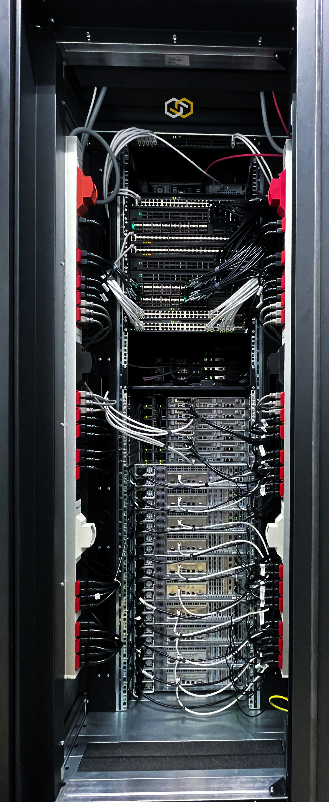

# Documentation of the VP18 Environment

## Overview

* Standards
  * [Hostname Naming](documentation/standards/Hostname_Naming.md)
  * [Network Connections](documentation/standards/System_Network_Connections.md)
* Documentation of the System
  * [Administration of the Hardware Landscape](documentation/System_Administration.md)
  * [The rack configuration](documentation/System_Rack_Setup.md)
  * [General Network Information](documentation/System_Networks.md)
  * [The Networking Diagram](documentation/System_Network_Diagram.md)
  * [Detailed Description of the Network Wireing](documentation/System_Network_Wireing.md)
  * [Detailed Description of the Power Wireing](documentation/System_Power_Wireing.md)
  * Hardware Devices
    * Networking Equipment
      * [Edgecore 7326-56X-O-AC-B](documentation/devices/network/Edgecore_7326-56X-O-AC-B.md)
      * [Edgecore 5835-54X-O-AC-B](documentation/devices/network/Edgecore_5835-54X-O-AC-B.md)
      * [Edgecore 4630-54TE-O-AC-B](documentation/devices/network/Edgecore_4630-54TE-O-AC-B.md)
      * [Edgecore 7726-32X-O-AC-B](documentation/devices/network/Edgecore_7726-32X-O-AC-B.md)
    * Server Equipment
      * [Supermicro H12SSL-NT](documentation/devices/servers/Supermicro_H12SSL-NT.md)
      * [Supermicro H12SSL-CT](documentation/devices/servers/Supermicro_H12SSL-CT.md)
      * [Supermicro ARS-110M-NR](documentation/devices/servers/Supermicro_ARS-110M-NR.md)
      * [Supermicro A2SDV-4C-LN8F](documentation/devices/servers/Supermicro_A2SDV-4C-LN8F.md)
      * [Supermicro A2SDV-8C-LN8F](documentation/devices/servers/Supermicro_A2SDV-8C-LN8F.md)

## A visual impression

     

## What describes this repository?

This repository describes the envrionment build for VP18.
VP18 runs a hardware environment in a colocation located at [JH Computers](https://jh-computers.de/).

The main goals of this environment are:

* Provide a network testing lab for:
  * Switch/network automation
  * Sonic packaging
  * Evaluating network architecture concepts
  * Test environment to evaluate and test concepts and implementations in layer-3 underlay networking with SONiC
  * Test environment to evaluate and test improvements to the monitoring stack
* Run a "production-like" experimentation and testing plattform
  * Demonstration showroom for interested parties
    (A blueprint for potential SCS operators to get an idea of the OSISM setup)
  * Training and demonstration environment
  * Testing of new releases
    (Environment for the future execution of QA tests)
  * Reproduce and analyze production problems on a real system
  * Develop and test topics that can only be analyzed, tested or reproduced on a real system
  * Dogfooding / continuous operation with real workload
  * Develop operational procdures
  * Develop and test certification tests

